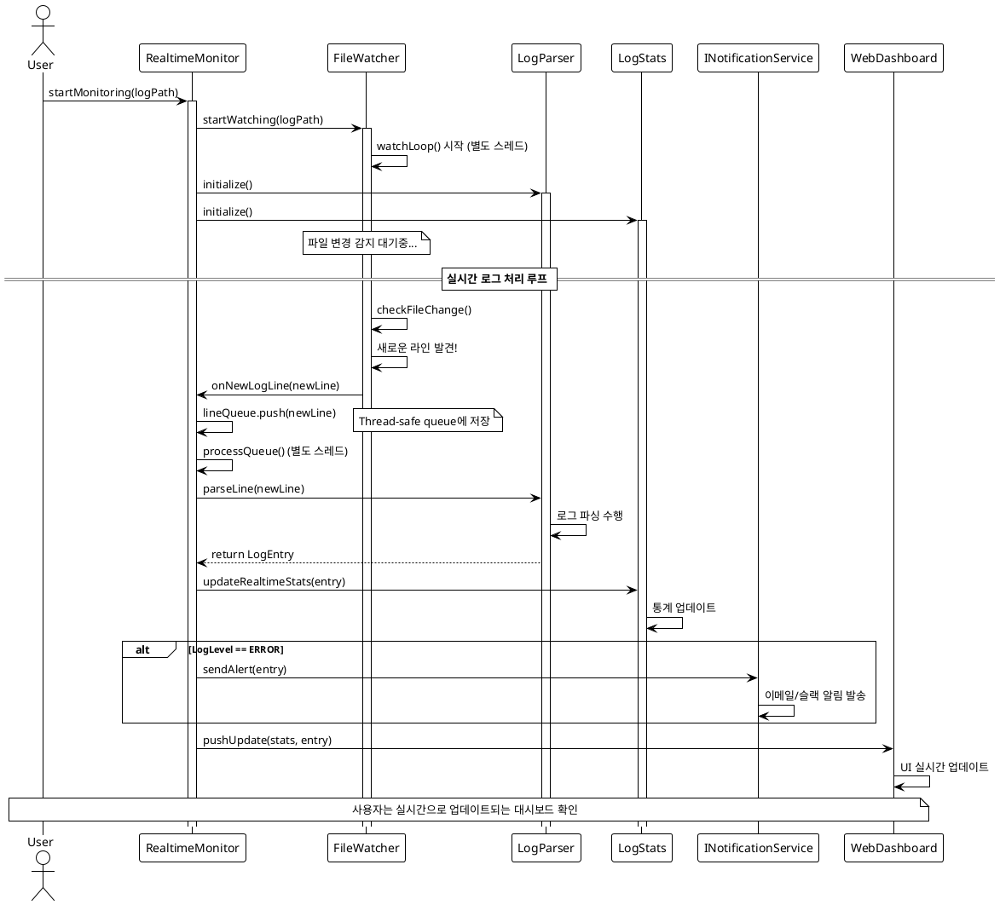

# 🤖 3단계 (6~7교시): AI 워크플로우 마스터 및 종합 실습

> **학습 목표**: **1-2단계에서 발전시킨 LogAnalyzer 프로젝트**를 실시간 모니터링으로 확장하며, 전통적인 **수동 워크플로우**와 **AI 자동화 워크플로우**를 비교 체험합니다. PlantUML 시각적 설계부터 MD 작업지시서 생성, 실제 구현까지의 전체 개발 프로세스를 AI와 협업으로 완성하며, 기존에 만든 안정적인 구조를 해치지 않는 실무적 확장 방법을 학습합니다.

---

## ⏰ 6교시 (15:00~15:50): AI 기반 작업지시서 워크플로우

**목표: 실무에서 활용하는 MD 기반 작업지시서 워크플로우를 마스터합니다. 수동 문서화 → AI 협업 → 반복 개선 → 체크리스트 기반 작업 관리까지 전체 프로세스를 경험하며, AI를 효과적으로 조절하고 활용하는 방법을 익힙니다.**

### 1부: MD 문서의 실무적 가치와 워크플로우 비교 (15분)

#### 기존 수동 방식의 문제점

1. 수동 방식은 요구사항 분석, 기술명세서 작성, 동료 검토, 구현까지 시간이 소요되며, **많은 시간**을 필요로 합니다.
2. 이 과정에서 엣지 케이스, 테스트 시나리오, 성능 고려사항 등 **중요한 요소들을 놓치기 쉽습니다.**

#### MD 문서 기반 워크플로우의 핵심 가치

**💡 실무 활용 사례**

```markdown
# 실제 개발에서 MD 문서를 쓰는 이유

1. **요구사항 정리**: 복잡한 기능을 구조화하여 명확히 전달
2. **외부 문서 통합**: API 명세, 라이브러리 가이드를 프로젝트에 맞게 재정리
3. **기능 확장 계획**: 단계별 구현 계획과 우선순위 명시
4. **팀 커뮤니케이션**: 비개발자도 이해할 수 있는 명확한 소통 도구
5. **AI 협업 최적화**: AI가 정확히 이해할 수 있는 구조화된 정보 제공
```

**🔑 MD 문서의 핵심 원칙**

- **형식보다 구조**: 꼭 MD일 필요 없음 (AI 인식에 문제없음)
- **완전성**: 거의 모든 작업 내용과 이유가 포함되어야 함
- **진화성**: 브레인스토밍처럼 계속 확장하고 개선
- **체크리스트**: AI가 스스로 작업하고 체크할 수 있는 구조

### 2부: 브레인스토밍 방식의 MD 문서 진화 실습 (20분)

#### 시나리오: "LogAnalyzer에 실시간 모니터링 기능 추가"

**Step 1: 초기 아이디어 직접 작성 (5분)**
먼저 수강생이 직접 간단한 요구사항을 작성합니다.

```markdown
# 초기 요구사항 (직접 작성)

- 로그 파일 실시간 감시
- ERROR 발생 시 알림
- 웹에서 실시간 업데이트
```

**Step 2: AI와 브레인스토밍으로 확장 (10분)**

```
📝 1차 확장 프롬프트:
"위 요구사항을 바탕으로 더 상세한 기술 명세서를 만들어줘.
다음 항목들을 포함해서:
- 기술 스택 선택 이유
- 구현 단계별 계획
- 예상되는 기술적 도전과제
- 테스트 전략
- 성능 고려사항"
```

**Step 3: 외부 문서 통합 및 2차 확장 (5분)**

```
📝 2차 확장 프롬프트:
"std::filesystem 공식 문서의 파일 감시 관련 내용을 참고해서
앞서 만든 명세서에 구체적인 구현 방법을 추가해줘.
특히 다음 사항들을 고려해서:
- 파일 변경 감지 메커니즘
- 크로스 플랫폼 호환성
- 메모리 사용량 최적화"
```

### 3부: PlantUML을 활용한 시각적 설계 (10분)

#### AI와 함께하는 시각적 아키텍처 설계

**💡 왜 PlantUML이 AI 협업에 중요한가?**

PlantUML은 텍스트 기반 다이어그램 도구로, AI가 이해하고 생성하기 쉬운 형태입니다. 복잡한 시스템 설계를 시각화하여 AI와의 소통을 더욱 정확하게 만들어줍니다.

**Step 1: Cursor와 함께 현재 구조 분석 및 다이어그램 생성**

```
📝 현재 구조 분석 프롬프트:
"1-2단계에서 발전시킨 01-legacy-c 폴더의 C++ 프로젝트를 분석해서
현재 LogAnalyzer 시스템의 클래스 다이어그램을 PlantUML 코드로 작성해줘.

@cursor-cpp-training/01-legacy-c/

지금까지 만든 LogFileReader, LogParser, LogStats 클래스들을 기반으로:
1. 각 클래스의 주요 멤버 변수와 메서드 구조
2. 클래스 간 의존성과 관계 (구성, 사용 등)
3. 데이터 흐름 (LogFileReader → LogParser → LogStats)
4. 실시간 모니터링 확장을 위한 설계 개선점 제시"
```

**Cursor가 생성할 현재 구조 다이어그램 목표:**

> **💡 1-2단계에서 만든 실제 프로젝트 기반**:
> 레거시 C 코드에서 시작해서 C++ 클래스로 전환하고,
> 테스트와 JSON 출력 기능까지 추가한 현재 상태를 시각화

```plantuml
@startuml LogAnalyzer_Current_State
!theme plain
!define LEGACY_COLOR #FF9999
!define CORE_COLOR #99CCFF
!define TEST_COLOR #99FF99
!define UTIL_COLOR #FFCC99

' 1단계에서 C 코드를 대체한 핵심 클래스들
class LogFileReader <<CORE_COLOR>> {
    -string filePath_
    -ifstream fileStream_
    -bool isValid_
    +LogFileReader()
    +bool openFile(const string& path)
    +vector<string> readLines()
    +bool isFileValid() const
    +void close()
}

class LogParser <<CORE_COLOR>> {
    -vector<LogEntry> entries_
    -LogLevel currentFilter_
    +LogParser()
    +LogEntry parseLine(const string& line)
    +void setFilter(LogLevel level)
    +vector<LogEntry> getFilteredEntries()
    +int getEntryCount() const
}

class LogStats <<CORE_COLOR>> {
    -map<LogLevel, int> levelCounts_
    -int totalEntries_
    -chrono::time_point startTime_
    +LogStats()
    +void calculateStats(const vector<LogEntry>& entries)
    +void printSummary() const
    +void exportToJson(const string& filename)
    +double getProcessingTime() const
}

' 2단계에서 추가된 구조체와 열거형
struct LogEntry <<UTIL_COLOR>> {
    +string timestamp
    +LogLevel level
    +string message
    +string fullLine
}

enum LogLevel <<UTIL_COLOR>> {
    ERROR
    WARNING
    INFO
    DEBUG
    UNKNOWN
}

' 2단계에서 추가된 테스트
package "tests/" <<TEST_COLOR>> {
    class TestLogParser {
        +testParseLine()
        +testSetFilter()
    }
    class TestMain {
        +Catch2 테스트 실행기
    }
}

LogFileReader ||--o LogParser : "provides raw lines"
LogParser ||--o LogStats : "provides parsed entries"
LogParser *-- LogEntry : "creates"
LogEntry *-- LogLevel : "contains"
TestLogParser ..> LogParser : "tests"

note right of LogFileReader : "C 코드의 fopen/fclose를\nRAII 패턴으로 대체"
note bottom of LogParser : "C 코드의 전역변수를\n객체지향으로 캡슐화"
note left of LogStats : "2단계에서 추가:\nnlohmann/json 라이브러리 연동"
note over TestLogParser : "2단계에서 추가:\nCatch2 단위 테스트"

@enduml
```

> **🎯 지금까지의 발전 과정**:
>
> 1. **1단계(2-3교시)**: C 파일 삭제 → C++ 클래스 전환 → CMake 도입
> 2. **2단계(4-5교시)**: 테스트 프레임워크 연동 → JSON 출력 기능 추가
> 3. **3단계(6-7교시)**: 실시간 모니터링으로 확장 예정

**Step 2: Cursor와 함께 실시간 모니터링 기능 확장 설계**

```
📝 확장 설계 프롬프트:
"위에서 생성한 현재 01-legacy-c 프로젝트 구조를 기반으로,
FileWatcher 실시간 모니터링 기능을 추가한 새로운 클래스 다이어그램을 PlantUML 코드로 작성해줘.

@cursor-cpp-training/01-legacy-c/

기존 클래스들(LogFileReader, LogParser, LogStats)은 그대로 유지하면서:
- FileWatcher 클래스: std::filesystem을 활용한 파일 변경 감지
- RealtimeMonitor 클래스: Observer 패턴으로 실시간 처리 조율
- 스레드 안전성: mutex를 활용한 동기화 메커니즘
- 2단계에서 만든 테스트 구조와의 호환성
- 확장성: 웹 대시보드 연동 가능한 구조"
```

**Cursor와 함께 생성할 확장된 다이어그램 목표:**

> **💡 점진적 확장 전략**:
> 1-2단계에서 완성한 안정적인 구조를 그대로 유지하면서,
> 실시간 모니터링 기능만 추가하여 프로젝트를 발전시킴

```plantuml
@startuml LogAnalyzer_Realtime_Extended
!theme plain
!define REALTIME_COLOR #FF6B6B
!define EXISTING_COLOR #4ECDC4
!define MONITOR_COLOR #45B7D1
!define TEST_COLOR #99FF99

' 1-2단계에서 완성된 기존 클래스들 (변경 없음)
class LogFileReader <<EXISTING_COLOR>> {
    -string filePath_
    -ifstream fileStream_
    -bool isValid_
    +bool openFile(const string& path)
    +vector<string> readLines()
    +bool isFileValid() const
}

class LogParser <<EXISTING_COLOR>> {
    -vector<LogEntry> entries_
    -LogLevel currentFilter_
    -mutex entriesMutex_
    +LogEntry parseLine(const string& line)
    +void setFilter(LogLevel level)
    +vector<LogEntry> getFilteredEntries()
    +void addRealtimeEntry(const LogEntry& entry)
}

class LogStats <<EXISTING_COLOR>> {
    -map<LogLevel, int> levelCounts_
    -mutex statsMutex_
    +void calculateStats(const vector<LogEntry>& entries)
    +void updateRealtimeStats(const LogEntry& entry)
    +void printLiveStats() const
}

' 새로 추가될 실시간 클래스들
class FileWatcher <<REALTIME_COLOR>> {
    -string watchPath_
    -bool isRunning_
    -thread watchThread_
    -chrono::file_time_type lastWriteTime_
    +void startWatching(const string& path)
    +void stopWatching()
    +void setCallback(function<void(string)> cb)
    -void watchLoop()
    -bool checkFileChange()
}

class RealtimeMonitor <<MONITOR_COLOR>> {
    -unique_ptr<LogParser> parser_
    -unique_ptr<LogStats> stats_
    -unique_ptr<FileWatcher> watcher_
    -queue<string> lineQueue_
    -mutex queueMutex_
    +void startMonitoring(const string& logPath)
    +void stopMonitoring()
    +void onNewLogLine(const string& line)
    +void processQueue()
}

interface INotificationService {
    +void sendAlert(const LogEntry& entry)
    +void sendStats(const LogStats& stats)
}

FileWatcher ||--o RealtimeMonitor : "notifies new lines"
RealtimeMonitor ||--o LogParser : "processes with"
RealtimeMonitor ||--o LogStats : "updates"
RealtimeMonitor ||--o INotificationService : "can notify"

' 2단계 테스트 구조도 유지
package "tests/" <<TEST_COLOR>> {
    class TestLogParser {
        +testParseLine()
        +testSetFilter()
    }
    class TestFileWatcher {
        +testFileChangeDetection()
        +testCallbackTrigger()
    }
}

TestLogParser ..> LogParser : "tests"
TestFileWatcher ..> FileWatcher : "tests"

note right of FileWatcher : "std::filesystem 활용\n1초마다 파일 변경 확인"
note bottom of RealtimeMonitor : "Producer-Consumer 패턴\nThread-safe queue 처리"
note left of INotificationService : "확장 가능한 알림 시스템\n(웹 대시보드, 이메일 등)"
note over TestFileWatcher : "3단계에서 추가:\n실시간 기능 테스트"

@enduml
```

> **🎯 학습 포인트**:
>
> 1. **점진적 발전**: 1-2단계에서 만든 안정적인 구조를 파괴하지 않고 확장
> 2. **기존 투자 보호**: 이미 작성한 테스트 코드와 JSON 기능 재활용
> 3. **시각적 설계**: PlantUML 색상으로 기존/신규 컴포넌트 구분
> 4. **실무적 접근**: 운영 중인 시스템에 새 기능 추가하는 시나리오

**Step 3: Cursor와 함께 실시간 처리 시퀀스 다이어그램 작성**

```
📝 시퀀스 다이어그램 생성 프롬프트:
"실시간 로그 모니터링의 전체 시나리오를 시퀀스 다이어그램으로 PlantUML 코드로 작성해줘:

시나리오:
1. 사용자가 RealtimeMonitor.startMonitoring() 호출
2. FileWatcher가 파일 변경 감지 시작
3. 새로운 로그 라인이 파일에 추가됨
4. FileWatcher가 변경 감지하고 콜백 호출
5. RealtimeMonitor가 라인을 큐에 추가
6. LogParser가 라인을 파싱
7. LogStats가 실시간 통계 업데이트
8. ERROR 레벨 발견 시 알림 발송
9. 웹 대시보드에 실시간 반영

비동기 처리와 스레드 간 통신도 표현해줘."
```

**Cursor와 함께 만들 시퀀스 다이어그램 목표:**



> **🎯 학습 포인트**:
>
> 1. 비동기 처리와 멀티스레딩 시나리오를 다이어그램으로 표현
> 2. Producer-Consumer 패턴의 시각적 이해
> 3. 조건부 처리(ERROR 알림)를 alt 블록으로 표현
> 4. 실제 시스템의 복잡한 상호작용을 단순화하여 표현

### 4부: 체크리스트 기반 AI 작업 관리 실습 (10분)

#### AI가 스스로 체크하며 작업하는 시스템 구축

**Step 1: 체크리스트 템플릿 생성**

```
📝 체크리스트 생성 프롬프트:
"다음 작업을 위한 상세한 체크리스트를 만들어줘:
'03-with-tests 폴더에 FileWatcher 클래스 추가'

체크리스트 형식:
- [ ] 작업명: 구체적 설명
- [ ] 완료 기준: 명확한 검증 방법
- [ ] 의존성: 선행 작업이나 필요 파일

각 항목마다 왜 필요한지 이유도 포함해줘."
```

**Step 2: AI가 체크리스트 따라 작업하도록 지시**

```
📝 체크리스트 기반 작업 프롬프트:
"위에서 만든 체크리스트를 하나씩 수행해줘.
각 항목을 완료할 때마다:
1. [x] 완료 표시
2. 무엇을 했는지 간단히 보고
3. 다음 항목으로 진행하기 전에 내게 확인 요청


```

**Step 3: 작업 진행 모니터링**
AI가 체크리스트를 따라 작업하는 과정을 관찰하며:

- 각 단계별 완료 확인
- 필요시 방향 수정이나 추가 요구사항 제시
- AI의 작업 품질 점검

#### 🎯 실무 팁: 효과적인 체크리스트 작성법

```markdown
# 좋은 체크리스트 예시

## 기능 구현

- [ ] **헤더 파일 생성**: FileWatcher.hpp에 클래스 선언 작성

  - 완료 기준: 컴파일 에러 없이 인클루드 가능
  - 이유: 인터페이스 먼저 설계하여 구현 방향 명확화

- [ ] **핵심 메서드 구현**: watch(), stop(), setCallback() 메서드 구현

  - 완료 기준: 기본 동작 테스트 통과
  - 의존성: std::filesystem, std::thread 헤더 필요

- [ ] **단위 테스트 작성**: test_file_watcher.cpp 생성
  - 완료 기준: 모든 테스트 케이스 PASS
  - 이유: 실시간 기능의 안정성 보장

## 통합 및 검증

- [ ] **CMakeLists.txt 업데이트**: 새 파일들을 빌드에 포함
- [ ] **메모리 누수 검사**: valgrind로 검증 (Linux 환경)
- [ ] **성능 테스트**: 대용량 로그 파일로 부하 테스트
```

### 5부: 실무 응용 전략 (10분)

#### PlantUML과 MD 문서 연계 활용

**시각적 설계가 AI 협업에 미치는 영향**

```markdown
# PlantUML + AI 협업의 시너지 효과

## 1. 정확한 의사소통

- 복잡한 아키텍처를 다이어그램으로 명확히 표현
- AI가 텍스트보다 구조를 더 정확히 이해
- 구현 과정에서의 오해와 시행착오 최소화

## 2. 설계 검증

- AI가 다이어그램을 분석하여 설계 문제점 지적
- 패턴 적용의 적절성 검토
- 확장성과 유지보수성 측면에서의 피드백

## 3. 문서 품질 향상

- MD 문서에 다이어그램 임베드로 완성도 증가
- 개발팀 내 소통 효율성 극대화
- 신규 팀원의 코드 이해도 향상
```

**PlantUML 코드 생성을 위한 효과적인 프롬프트 패턴**

```
📝 클래스 다이어그램 생성 템플릿:
"다음 요구사항에 맞는 클래스 다이어그램을 PlantUML로 작성해줘:
- 주요 클래스: [클래스명 나열]
- 관계: [상속, 구성, 의존성 등]
- 패턴: [적용할 디자인 패턴]
- 제약사항: [성능, 메모리, 스레드 안전성 등]
색상과 노트를 포함해서 읽기 쉽게 만들어줘."
```

```
📝 시퀀스 다이어그램 생성 템플릿:
"다음 시나리오의 시퀀스 다이어그램을 PlantUML로 작성해줘:
- 시작점: [사용자 액션 또는 이벤트]
- 참여 객체: [관련 클래스들]
- 주요 흐름: [단계별 상호작용]
- 예외 처리: [에러 상황과 대응]
비동기 호출과 옵셔널 구간도 표시해줘."
```

#### MD 문서의 다양한 활용 사례

**기능 확장 시**

```markdown
# 새 기능 추가 템플릿

## 배경 및 목적

## 기술적 요구사항

## 구현 계획 (1단계, 2단계...)

## 리스크 및 대응방안

## 테스트 시나리오

## 완료 후 검증 기준
```

**외부 라이브러리 통합 시**

```markdown
# 라이브러리 통합 가이드

## 선택 이유 (대안 비교)

## 설치 및 설정 방법

## 프로젝트 적용 방법

## 주의사항 및 제약사항

## 예제 코드 및 사용법
```

**🎉 핵심 포인트**: MD 문서는 단순한 기록이 아니라 **AI와의 협업을 최적화하는 도구**입니다. 잘 구조화된 문서가 있으면 AI도 더 정확하고 체계적으로 작업할 수 있습니다.

---

## ⏰ 7교시 (16:00~16:50): 전체 학습 종합 실습

**목표: 1-6교시에서 배운 모든 내용(레거시 분석, C++17 리팩터링, 테스팅, AI 협업)을 활용하여 실제 업무와 유사한 복합 프로젝트를 end-to-end로 완성합니다.**

### 종합 프로젝트 시나리오: "LogAnalyzer 운영 버전 개발"

#### 프로젝트 배경 예시

> 삼성전자 VD사업부에서 실제 운영 중인 시스템의 로그를 분석하는 도구가 필요합니다. 기존 레거시 C 코드를 현대적인 C++17 기반으로 전환하고, 테스트를 포함한 안정적인 버전을 개발해야 합니다.

#### 실습 미션 (30분)

**개인별 종합 프로젝트**
각 수강생이 **1-6교시 전체 학습 내용**을 활용하여 LogAnalyzer의 완전한 버전을 개발합니다.

**실습 요구사항**

1. **AI 활용 필수**: 모든 작업에 Cursor AI 협업 활용
2. **문서화**: 각 단계별 작업 과정을 MD 파일로 기록
3. **품질 기준**: Catch2 테스트 통과, 메모리 누수 없음
4. **실무 적용**: 실제 운영 환경을 고려한 에러 처리

#### 개인 실습 단계

**Step 1: LogAnalyzer 확장 영역 선택 (5분)**
1-2단계에서 발전시킨 LogAnalyzer 프로젝트를 기반으로, 다음 중 하나를 선택하여 심화 확장:

```

A. "실시간 모니터링 시스템"
   - 01-legacy-c 프로젝트에 FileWatcher 및 실시간 알림 기능 추가

B. "웹 대시보드 연동"
   - 현재 JSON 출력을 활용한 실시간 웹 인터페이스 구현

C. "성능 최적화 및 확장"
   - 대용량 로그 처리를 위한 멀티스레딩 및 메모리 최적화

```

**Step 2: Cursor와 PlantUML 시각적 설계 (5분)**
선택한 영역에 대한 클래스/시퀀스 다이어그램을 Cursor와 함께 PlantUML로 작성하여 구현 방향 명확화

```
📝 개인 프로젝트 다이어그램 생성 예시:
"내가 선택한 '[선택 영역]' 기능을 위한 클래스 다이어그램을 PlantUML로 작성해줘.

@cursor-cpp-training/01-legacy-c/

1-2단계에서 발전시킨 현재 프로젝트 구조를 분석해서:
- 기존 LogFileReader, LogParser, LogStats 클래스와의 통합 방법
- 새로 추가할 클래스의 설계 (웹 대시보드 / 알림 시스템 / 성능 최적화 중 선택)
- 2단계에서 구축한 테스트 구조와의 호환성
- 지금까지의 발전 과정을 해치지 않는 확장 설계"
```

**Step 3: MD 작업지시서 작성 (5분)**
6교시에서 배운 브레인스토밍 방식과 PlantUML 다이어그램을 포함한 상세 작업 계획을 MD 문서로 작성

**Step 4: 체크리스트 기반 구현 (15분)**
시각적 설계, MD 문서, 체크리스트를 바탕으로 실제 코드 작성 및 테스트

#### 개인별 발표 (댓글)

- 선택한 영역과 완성된 결과물 데모
- AI 활용 과정에서의 시행착오와 해결 방법
- 가장 효과적이었던 프롬프트와 MD 문서 활용 사례

#### 종합 토론

**주제**: "AI 협업의 현실적 한계와 개인 워크플로우 최적화"

- AI가 잘못 이해했던 순간들과 개선 방법
- 어떤 작업은 여전히 사람이 더 효율적인가?
- 개인 개발에서 AI를 어떻게 전략적으로 활용할 것인가?

## 📊 3단계 완료 체크리스트

### 6교시 체크리스트

- [ ] 전통적 워크플로우와 AI 워크플로우 차이점 이해
- [ ] PlantUML을 활용한 시각적 아키텍처 설계 경험
- [ ] AI를 활용한 요구사항 분석 및 MD 작업지시서 생성 경험
- [ ] 체크리스트 기반 AI 작업 관리 시스템 구축
- [ ] 생성된 문서를 바탕으로 한 실제 구현 완료

### 7교시 체크리스트

- [ ] PlantUML 다이어그램으로 선택 영역의 설계 시각화
- [ ] 1-6교시 학습 내용을 종합한 개인 실전 프로젝트 수행
- [ ] 선택 영역에 대한 심화 개발 경험 (실시간 모니터링/웹 대시보드/성능 최적화 중 선택)
- [ ] 시각적 설계, MD 문서, 체크리스트를 통합한 완전한 워크플로우 실습
- [ ] AI 활용의 실무적 한계와 개인 워크플로우 최적화 전략 도출

**🎉 전체 교육과정 완료!**
**여러분은 이제 레거시 코드 분석부터 현대적 C++ 개발, AI 협업까지 실무에서 바로 적용 가능한 역량을 갖추었습니다. AI 네이티브 개발자로서의 첫 걸음을 성공적으로 완료했습니다!**
